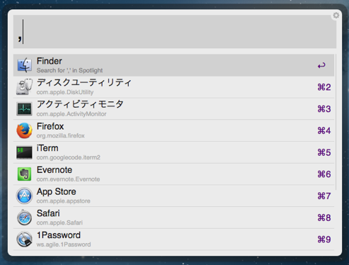
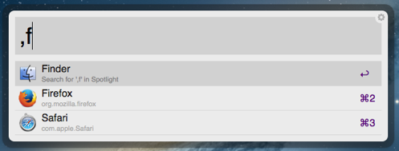

AppSwitch.alfredworkflow
=========================

Switch to other running applications via Alfred2

[get the latest version](https://github.com/ts123/AppSwitch.alfredworkflow/releases/latest)

Usage
------------

1) type comma to display a list of running applications ordered by last use.

2) you can continue typing application name to narrow candidates.

3) select (and enter) a list item to activate the application.

Dependencies
------------
AppSwitch uses [alfred-python](https://github.com/nikipore/alfred-python), [CopyLaunchedApplicationsInFrontToBackOrder.c](https://gist.github.com/0xced/163918)
